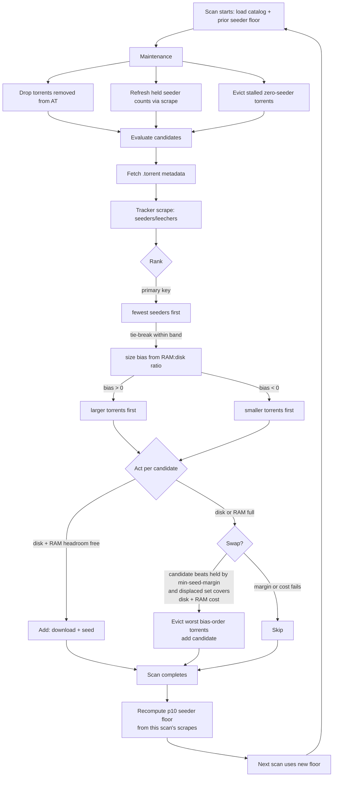

# keep-at

keep-at is a standalone daemon that seeds [Academic Torrents](https://academictorrents.com) automatically. Point it at some disk space, and it fills that space with whatever's most in need of seeding right now, favoring torrents with few seeds over torrents that are already healthy. The goal is to spread seeding load across the AT catalog instead of everyone piling onto the same popular torrents while obscure datasets rot with one seed (or fall to zero seeds and are lost).

It's built on [rqbit](https://github.com/ikatson/rqbit) and runs on whatever Linux you've got: a Raspberry Pi, a whole server, a VM, or a container.

## Usage

### Installing

The easiest way, on Linux:

```
curl -fsSL https://raw.githubusercontent.com/tweedge/keep-at/main/scripts/install.sh | sh
```

That fetches the latest [release](https://github.com/tweedge/keep-at/releases), picks the right binary for your architecture, and installs it to `/usr/local/bin` (or `~/.local/bin` if you're not root and can't write there). Pass `VERSION=v1.2.3` before the pipe to install a specific version instead of the latest. Prebuilt binaries cover Linux (amd64/arm64/arm/386); the install script itself is meant to be piped straight into `sh`. On other platforms, build from source below.

Or run the prebuilt image in Docker:

```
docker run -v ./data:/data -v ./storage:/storage ghcr.io/tweedge/keep-at:latest --storage-limit 500G
```

Building from source (needs a Rust toolchain - no OpenSSL dev headers required, TLS and hashing use rustls/ring) is only necessary if you're modifying keep-at itself:

```
cargo build --release
```

or to build the Docker image locally instead of pulling it:

```
docker build -t keep-at .
docker run -v ./data:/data -v ./storage:/storage keep-at --storage-limit 500G
```

### Quick Start

A config file is optional. Every setting has a flag, and there's a sensible default storage location for Linux already (`~/.local/share/keep-at/storage`, or `/var/lib/keep-at/storage` when there's no home directory) - the only thing keep-at won't guess is how much space you're willing to give it:

```
keep-at run --storage-location ~/.local/share/keep-at/storage --storage-limit 500G
```

That's the only variable you need to set to start. `keep-at run --help` lists every other flag (port, aggressiveness, scan interval, rate limit, and so on), all with reasonable defaults. Multiple drives never need a config file either - repeat the pair: `--storage-location /mnt/disk1 --storage-limit 500G --storage-location /mnt/disk2 --storage-limit 2T`.

### Service Usage

keep-at is designed to be used as a long-running service on an always-on server, VM, or similar. Where `keep-at run` starts it in the foreground (good for seeing what's going on), `service install` is what you want for something that stays up (Linux with systemd; elevates automatically when needed, no sudo prefix required):

```
keep-at service install --storage-location /mnt/data/keep-at --storage-limit 500G
keep-at service uninstall
```

`service install` takes the same flags as `run`, resolves them the same way, and writes the result to `/etc/keep-at/config.yaml` - installing the config alongside the service, rather than baking flags into the unit or requiring you to remember them. That's also what makes every other command below work with no arguments at all: once that file exists, `stop`, `status`, `network-status`, `hosted-torrents`, and even a bare `run`/`start` all check it automatically to find out where the running instance lives.

```
keep-at start
keep-at stop
keep-at status
keep-at network-status
keep-at hosted-torrents
```

`hosted-torrents` lists everything this host currently holds and seeds: title, verified bytes present, seeding/downloading status, last-scrape seeder counts, and a link to each torrent's Academic Torrents page. When the daemon is running both it and `status` read live numbers straight from it (never stale); when it isn't, they fall back to the persisted files.

`start` and `run` take the exact same flags as `service install` - `start` just forks `run` into the background for you (or runs it in the foreground directly, inside a container). None of these commands need `--config` once keep-at is installed as a service; pass it explicitly only if you're managing a non-service instance, or one installed somewhere unusual.

To change settings later, edit `/etc/keep-at/config.yaml` directly and run `systemctl restart keep-at` (with sudo if your shell isn't root), or just run `service install` again with new flags. `service install` and `self-update` re-execute keep-at elevated on their own when the target needs root (system files, or a root-owned binary in /usr/local/bin or /usr/bin) — you never prefix them with sudo yourself, which also sidesteps the classic failure where keep-at is on your PATH but not root's.

And to update to the latest release:

```
keep-at self-update
```

By default this only considers stable releases (`x.y`, e.g. `v0.9`). To track development builds (`x.y.z-beta`, e.g. `v0.9.1-beta`), add `--beta`:

```
keep-at self-update --beta
```

### Advanced Configuration Settings

A config file is only worth reaching for once you want more than one storage location, or don't want to repeat flags every time (`service install` writes one for you automatically - see above). Point `--config` at a path that doesn't exist yet and keep-at will write a starter one there and tell you to edit it:

```
keep-at run --config ~/.config/keep-at/config.yaml
```

At minimum, set a real limit below (the starter ships with the field blank):

```yaml
port: 37550
data_dir: /home/you/.local/share/keep-at
storage:
- path: /mnt/disk1/keep-at
  limit: 500G
```

Every field here, plus its CLI flag equivalent and what it actually does, is documented in [docs/CONFIG.md](docs/CONFIG.md). You never have to touch a config file if you don't want to: repeatable `--storage-location PATH --storage-limit SIZE` pairs configure any number of drives entirely from flags.

### Filling a dedicated drive: `limit: max`

A storage location's `limit` can be the literal `max` (or `--storage-limit max`) instead of a byte count. keep-at then resolves it at startup to **97.5% of the device's total formatted capacity** - it measures the filesystem and leaves the last 2.5% (plus whatever the filesystem itself reserves) for the journal, metadata, and the OS's emergency operations.

```
keep-at run --storage-location ~/.local/share/keep-at/storage --storage-limit max
```

```yaml
storage:
- path: /mnt/dedicated-drive/keep-at
  limit: max
```

> **DANGER: dedicated drives only. Never use `max` on an OS drive.** With `limit: max`, keep-at will attempt to fill the device to the resolved fraction - on a system disk that can choke the OS out of space for logs, swap, package managers, and the boot process itself. Use it only on a drive whose entire purpose is storing torrent data. A fixed byte limit is always safer if you're unsure.

### Stalled downloads free themselves

A torrent that falls to zero seeders and never completes can't ever finish - with no seeders, nobody can serve its missing pieces. keep-at tracks download progress per held torrent and, after `scan.stall_eviction_timeout` (default **two weeks**, configurable via `--stall-eviction-timeout` or `stall_eviction_timeout` in a config file; `0` disables), removes any held torrent that has stayed at zero seeders and gained no new pieces, freeing its slot and disk for a torrent that can actually complete. A torrent is only ever considered stalled once its clock has run a full quiet period - progress resets it - so slow-but-alive downloads are never evicted.

### Academic Torrents API Keys

*Optional.* keep-at works exactly the same with or without an API key - if you don't set one, you seed anonymously and nothing about what keep-at holds or how it behaves changes. The only difference is attribution.

Academic Torrents shows a "Hosted by" box on every torrent's details page listing the users who are hosting that data, and it associates a hoster with their account via a passkey embedded in the announce URL. If you'd like the torrents you seed to be credited to your account rather than shown anonymously, pass your API key (from https://academictorrents.com/my.php, formatted like `uid=12345;pass=abcdef...`):

```
keep-at run --api-key 'uid=12345;pass=abcdef...' --storage-location ~/.local/share/keep-at/storage --storage-limit 500G
```

keep-at announces to AT's tracker with that passkey so the attribution happens automatically. The key is only ever sent to Academic Torrents' own trackers (`academictorrents.com` and `ipv6.academictorrents.com`); third-party trackers never see it, and keep-at never logs it or writes it into cached torrent files. You can also set it in a config file as `api_key` (see below).

### Bandwidth limits

*Optional.* By default keep-at transfers as fast as the swarms allow in both directions. On a connection you share with other things - or a seedbox with a monthly transfer quota - cap it globally:

```
keep-at run --upload-rate-limit 50M --download-rate-limit 20M --storage-location ~/.local/share/keep-at/storage --storage-limit 500G
```

Each limit applies **across all torrents at once** (one shared limiter on the torrent client, not a per-torrent budget), in bytes per second with the usual size suffixes (`50M` = 50 MiB/s); `0` means unlimited. The same settings live in a config file as `upload_rate_limit` / `download_rate_limit`. Note the scan traffic to Academic Torrents itself (catalog fetches, scrapes) has its own separate limiter (`--rate-limit`, default 0.5 requests/second) and is unaffected by these caps. Full details in [docs/CONFIG.md](docs/CONFIG.md).

### VPN Compatibility

*Optional.* Running behind a VPN comes with real tradeoffs (mainly around port forwarding and speed) that are worth understanding before turning one on - see [docs/VPN.md](docs/VPN.md) for a general guide covering both Docker (via [gluetun](https://github.com/passteque/gluetun)) and service-level (WireGuard) setups.

## How It Works

Every scan, keep-at pulls Academic Torrents' `database.xml`, skips held / blocked / oversized / too-young torrents, scrapes seeder counts, and ranks by fewest seeders first. The seed-scarcity gate (`n = aggressiveness ^ max(0, seeders - floor)`, floor = p10 seeder count from the last completed scan) keeps every node from piling onto the same torrent. Full space fills with the best candidates; a full disk swaps held torrents for better ones only when the candidate beats them by `--min-seed-margin` (default 2) seeds.

Seeder count is always the primary key: the adaptive size bias only ever orders *within* an equal-seeder band, so a 1-seeder torrent outranks a 2-seeder one at any bias. The p10 floor is recomputed from the completed scan's own scrape data every pass, independent of the bias.

### Adaptive size bias: matching torrents to the host's RAM:disk ratio

RAM cost tracks torrent *count* and piece count; disk tracks bytes. A host with 1 GiB of RAM and 1 TB of disk therefore wants *different torrents* than a host with 64 GiB and the same disk: the small box must spend each scarce RAM slot on as many bytes as possible, while the big box can afford to spend plentiful slots on many small torrents the small boxes skip. Both serve the network; they just serve different ends of the catalog.

At startup keep-at computes a size bias in [-1, +1] from the host's RAM:disk ratio (80%-of-RAM budget vs total configured disk limits, logged as `size-bias`). Within each seeder band, ties break by bytes-per-RAM-byte raised to that exponent: positive bias favors larger torrents, negative bias favors smaller ones, and the exponent is small on purpose - a "small multiple", so size nudges but urgency decides. Swap eviction mirrors the same order (a large-biased host evicts its worst bytes-per-RAM torrents first; a small-biased host evicts its largest first), so rescans reinforce the ranking instead of fighting it.

Recommended provisioning is **1 GiB of RAM per 1 TB of storage**, which lands near bias ≈ 0 with a mild large lean. Less RAM works: the bias grows toward +1 and the node holds fewer-but-larger torrents. More RAM works: the bias goes negative and the node holds numerous-but-smaller torrents with higher RAM cost each. Either way the RAM budget is a hard ceiling - free-space fill still refuses any candidate whose RAM price exceeds remaining headroom, and swaps still require the displaced set to cover the candidate's RAM cost - so the node can never spend its way into an OOM.



## How much RAM per TB of storage

Recommended provisioning: **~1 GiB of physical RAM per 1 TB of storage.** With the adaptive size bias, that ratio fills the disk: the host lands near bias ≈ 0 with a mild large lean and holds on the order of a thousand large torrents. RAM cost tracks torrent count and piece count, while disk tracks bytes, so what the slots total in bytes depends on *which* torrents urgency ranking selects: the same ~1,190 slots hold ~20 GB at a 16 MB torrent average, or ~2 TB at the 1.72 GB average of the catalog's 600 largest entries. The size bias steers toward the latter on RAM-short hosts, which is what makes 1 GiB:1 TB work.

Less RAM than the recommendation works by finding and prioritizing fewer-but-larger torrents with lower RAM cost per byte (bias toward +1): a 512 MiB + 1 TB box holds ~600 large torrents and seeds hundreds of GB usefully within budget. More RAM works by finding and prioritizing numerous-but-smaller torrents with higher RAM cost each (bias toward −1): a 64 GiB box spends its ~50k slots on the small end of the catalog the big hosts skip. On a RAM-short box the disk will sit partly empty by design - free-space fill refuses anything whose RAM price exceeds remaining headroom, because the alternative is exceeding the RAM budget and OOMing the host. If the disk must be full, add RAM, not flags: no selection parameter can hold more torrents than the budget prices.

`--max-ram` caps the budget below the 80% default (never above). The startup log prints the resolved `budget`, `peer-limit`, `size-bias`, and `max-torrents` so the arithmetic above is checkable per host. The full rationale for all of that is in [docs/DESIGN.md](docs/DESIGN.md).

## Testing

`cargo test` covers everything except two tests that talk to real Academic Torrents infrastructure and are skipped by default:

```
KEEPAT_SMOKE_TEST=1 cargo test --test smoke   # full scan against a couple of real, small, already-seeded torrents
KEEPAT_SMOKE_SUBSET=1 cargo test --test smoke # real-catalog subset scan (~100 smallest entries, ~10 min)
```

The smoke test downloads two real files from Academic Torrents (a few KB each) into a temp directory and confirms a full engine scan selects, holds, and completes them.

## Releasing

Update `RELEASE_NOTES.md` at the repo root with what's actually in the release, commit it, then push a matching version tag. Versioning scheme: stable releases are `x.y` (e.g. `v0.9`), development builds are `x.y.z-beta` (e.g. `v0.9.1-beta`) — two components stable, three plus the `-beta` suffix beta. Always soft-wrap `RELEASE_NOTES.md` - each paragraph or bullet on one line, no matter how long, letting the renderer wrap it - never hard-wrap with manual line breaks partway through a paragraph. GitHub's release view renders single trailing newlines as literal breaks, so a hard-wrapped paragraph shows up as a jagged staircase instead of a normal paragraph.

```
git tag v0.9
git push origin v0.9
```

or for a development beta:

```
git tag v0.9.1-beta
git push origin v0.9.1-beta
```

Two GitHub Actions workflows watch for tags matching `v*.*.*`: `.github/workflows/release.yml` cross-compiles Linux targets in `scripts/build-release.sh` (glibc-linked binaries for amd64/arm64/arm/386) and publishes them as a GitHub release using `RELEASE_NOTES.md` as the release notes, and `.github/workflows/docker.yml` builds a multi-arch (amd64/arm64) image and pushes it to `ghcr.io/tweedge/keep-at` tagged with the version, the `major.minor`, and `latest`. Neither needs any repo secrets - both run entirely on the `GITHUB_TOKEN` Actions provides automatically.
