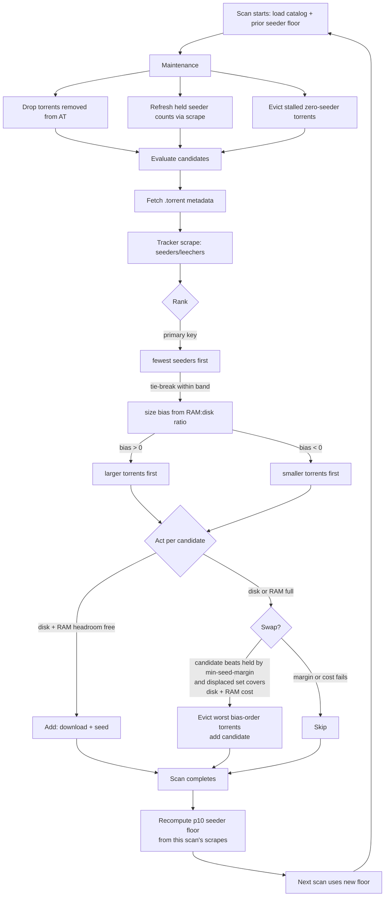

# keep-at (Rust/rqbit migration)

A smart node that seeds Academic Torrents. This is the Rust port of keep-at
(Go + anacrolix/torrent), rebuilt on [rqbit](https://github.com/ikatson/rqbit)
(`librqbit` 9.x) for lower memory/CPU use and crash resistance. Linux-only.

## Quick start

```sh
# One-line install (Linux x86_64/aarch64):
curl -fsSL https://raw.githubusercontent.com/tweedge/keep-at/rust-migration/scripts/install.sh | sh

# Or with Docker:
docker run -v ./data:/data -v ./storage:/storage ghcr.io/tweedge/keep-at \
  --storage-limit 500G

# Or from source (needs a Rust toolchain, no OpenSSL dev headers required -
# TLS + hashing use rustls/ring):
cargo build --release
./target/release/keep-at run --storage-limit 500G
```

At minimum: `keep-at run --storage-limit 500G`. A config file is optional;
every setting has a `--flag` (`keep-at run --help`). Repeatable
`--storage-location PATH --storage-limit SIZE` pairs mean multiple drives
never need a config file either.

## Commands

- `keep-at run` - run in the foreground
- `keep-at start` - start as a background process (`--foreground` to not daemonize)
- `keep-at stop` - stop the background process
- `keep-at status` - report whether keep-at is running + runtime summary
- `keep-at service install|uninstall` - systemd service (Linux, root)
- `keep-at network-status` - census the keep-at network (RAM/time-heavy, on demand)
- `keep-at hosted-torrents` - list torrents this host holds and seeds
- `keep-at self-update [--beta]` - update to the latest release
- `keep-at version` - print the version

## How it picks torrents

Every scan, keep-at pulls Academic Torrents' `database.xml`, skips held /
blocked / oversized / too-young torrents, scrapes seeder counts, and ranks
by fewest seeders first. The seed-scarcity gate (`n = aggressiveness ^
max(0, seeders - floor)`, floor = p10 seeder count from the last completed
scan) keeps every node from piling onto the same torrent. Full space fills
with the best candidates; a full disk swaps held torrents for better ones
only when the candidate beats them by `--min-seed-margin` (default 2)
seeds. Zero-seeder torrents with no progress past `--stall-eviction-timeout`
(default 14 days) are freed.

Seeder count is always the primary key: the size bias below only ever orders
*within* an equal-seeder band, so a 1-seeder torrent outranks a 2-seeder one
at any bias. The p10 floor is recomputed from the completed scan's own
scrape data every pass, independent of the bias.

### Adaptive size bias: matching torrents to the host's RAM:disk ratio

RAM cost tracks torrent *count* and piece count; disk tracks bytes. A host
with 1 GiB of RAM and 1 TB of disk therefore wants *different torrents*
than a host with 64 GiB and the same disk: the small box must spend each
scarce RAM slot on as many bytes as possible, while the big box can afford
to spend plentiful slots on many small torrents the small boxes skip. Both
serve the network; they just serve different ends of the catalog.

At startup keep-at computes a size bias in [-1, +1] from the host's RAM:disk
ratio (80%-of-RAM budget vs total configured disk limits, logged as
`size-bias`). Within each seeder band, ties break by bytes-per-RAM-byte
raised to that exponent: positive bias favors larger torrents, negative
bias favors smaller ones, and the exponent is small on purpose — a "small
multiple", exactly as intended, so size nudges but urgency decides. Swap
eviction mirrors the same order (a large-biased host evicts its worst
bytes-per-RAM torrents first; a small-biased host evicts its largest
first), so rescans reinforce the ranking instead of fighting it.

Recommended provisioning is **1 GiB of RAM per 1 TB of storage**, which
lands near bias ≈ 0 with a mild large lean. Less RAM works: the bias grows
toward +1 and the node holds fewer-but-larger torrents (see napkin math
below). More RAM works: the bias goes negative and the node holds
numerous-but-smaller torrents with higher RAM cost each. Either way the RAM
budget is a hard ceiling — free-space fill still refuses any candidate
whose RAM price exceeds remaining headroom, and swaps still require the
displaced set to cover the candidate's RAM cost — so the node can never
spend its way into an OOM.



## Storage

Plain on-disk layout: `<location>/<infohash-hex>/` holds the torrent's real
files (sparse), so locations never overlap and data is directly usable.
Accounting uses nominal size + a small per-torrent buffer and never exceeds
a location's limit. `limit: all` (or `--storage-limit all`) resolves to
97.5% of the device's formatted capacity - dedicated data drives only.

## Napkin math: how much RAM per TB of storage

Recommended provisioning: **~1 GiB of physical RAM per 1 TB of storage.**
With the adaptive size bias, that ratio fills the disk: the host lands near
bias ≈ 0 with a mild large lean and holds on the order of a thousand large
torrents. The older dual figure below explains *why* the bias is needed —
RAM cost tracks torrent count and piece count, while disk tracks bytes:

- Per-torrent RAM ≈ 256 KiB base + 64 B/piece + 48 KiB × peer-limit.
  A typical catalog torrent (~1k pieces) costs ~0.7 MiB at peer-limit 8.
- Budget is 80% of physical RAM, so a 1 GiB box plans around ~820 MiB →
  ~1,190 slots.
- What those slots total in bytes depends on *which* torrents urgency
  ranking selects, and that is the whole ballgame:
  - Live 327-torrent node: 16 MB average → 1,190 slots ≈ 20 GB per TB
    of attached disk (~2% utilization of a 1 TB drive).
  - Same 1,190 slots at the 1.72 GB average of the catalog's 600 largest
    entries → ~2 TB. The 1 GiB box fills a 1 TB drive twice over.

So RAM per TB is not a property of the disk - it is a property of the
average torrent size the network needs seeded when your node scans, which
is exactly what the size bias steers:

| torus profile | slots/TB | RAM per TB of *filled* disk |
|---|---|---|
| 16 MB average (small-torrent mix) | ~67,000 | ~60 GiB physical |
| 1.7 GB average (600 largest catalog entries) | ~600 | ~1 GiB physical |

Less RAM than the recommendation works by finding and prioritizing
fewer-but-larger torrents with lower RAM cost per byte (bias toward +1):
a 512 MiB + 1 TB box holds ~600 large torrents and seeds hundreds of GB
usefully within budget. More RAM works by finding and prioritizing
numerous-but-smaller torrents with higher RAM cost each (bias toward −1):
a 64 GiB box spends its ~50k slots on the small end of the catalog the big
hosts skip. On a RAM-short box the disk will sit partly empty by design —
free-space fill refuses anything whose RAM price exceeds remaining
headroom, because the alternative is exceeding the RAM budget and OOMing
the host. If the disk must be full, add RAM, not flags: no selection
parameter can hold more torrents than the budget prices.

`--max-ram` caps the budget below the 80% default (never above). The
startup log prints the resolved `budget`, `peer-limit`, and `max-torrents`
so the arithmetic above is checkable per host.

## Design notes

See `docs/DESIGN.md` for the selection math and operational lessons (much of
it carries over; the torrent library changed from anacrolix/torrent to
rqbit). Key Rust-port differences:

- Scrapes are HTTPS-only (no UDP/BEP-15 fallback); the AT tracker answers
  for AT content.
- No webseeds: rqbit has no webseed support, and keep-at seeds from real peers.
- No compression backend: plain files, nominal-size accounting.
- Linux only: no macOS/Windows builds, no launchd/SCM service support.
- State files are new (clean break, no Go state import): `state.json`,
  `network-stats.json`, `runtime-stats.json`, `scrape-cache.json`,
  `torrent-cache/` under the data dir.

## Development

```sh
cargo test            # unit tests (offline)
KEEPAT_SMOKE_TEST=1 cargo test --test smoke   # fast live pipeline test
KEEPAT_SMOKE_SUBSET=1 cargo test --test smoke # real-catalog subset scan
```
